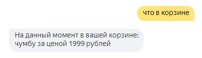

<p align="center">МИНИСТЕРСТВО НАУКИ  И ВЫСШЕГО ОБРАЗОВАНИЯ РОССИЙСКОЙ ФЕДЕРАЦИИ<br>
Федеральное государственное автономное образовательное учреждение высшего образования<br>
"КРЫМСКИЙ ФЕДЕРАЛЬНЫЙ УНИВЕРСИТЕТ им. В. И. ВЕРНАДСКОГО"<br>
ФИЗИКО-ТЕХНИЧЕСКИЙ ИНСТИТУТ<br>
Кафедра компьютерной инженерии и моделирования</p>
<br>

<h3 align="center">Отчёт по лабораторной работе № 2<br> по дисциплине "Программирование"</h3>

<br><br>

<p>студента 1 курса группы ИВТ-б-о-202(1)<br>
Лелеко Владислав Денисович<br>
направления подготовки 09.03.04 "Информатика и вычислительная техника"</p>

<br><br>

<table>

<tr><td>Научный руководитель<br> старший преподаватель кафедры<br> компьютерной инженерии и моделирования</td>

<td>(оценка)</td>

<td>Чабанов В.В.</td>

</tr>

</table>

<br><br>

<p align="center">Симферополь, 2020</p>

<hr>

Цель:

1. Получить представления о структуре post-запроса;
2. Изучить webhooks как метод взаимодействия web-приложений;

## Постановка задачи

Разработать и зарегистрировать навык для Алисы на сервисе Яндекс.Диалоги;

В качестве backend-a для навыка реализовать приложение на языке С++ выполняющее следующие функции:

- Составление продуктовой корзины:
    - Добавление продукта в корзину;
    - Удаление продукта из корзины;
    - Очистка корзины;
    - Вывод списка товаров в корзине;
    - Подсчёт стоимости товаров в корзине.

- Вывод справочной информации по навыку;

- Регистрацию webhook-ов сторонних сервисов;

- Отправку данных на сторонние сервисы. 

В качестве стороннего сервиса реализовать приложение на языке Python, выполняющее следующие функции:
    Ожидание данных о покупке;
    Сохранение поступивших данных в excel-документ.

## Выполнение работы

В начале работы был создан навык на странице яндекса. Название было выбрано лаконичное, чётко отражающее суть навыка -- "ЛабаЧ".


Рисунок 1. Скриншот настроек.

Далее была написана логика работы с диалогом Yandex.

В основном использовалось поле в запросе "command", которое содержит текст сообщения в нижнем регистре и очищенный от знаков препинания.

Для получения цены использовалась функция выделения сущностей в сообщении. К примеру, яндекс может определить улицу в сообщении пользователя, человека или число.
Пригодилось ещё поле, разделяющее command по словам в один массив. Из него программа получает название товара после фразы "добавь в корзину" до начала числа,
которое получается из данных сущности.



Рисунок 2. Скриншот диалога в обычном режиме.


Рисунок 3. Скриншот диалога в режиме помощи.

Веб-страница управления вебхуками генерируется простейшим образом. Для каждого вебхука из конфигурационного файла ссылка на вебхук заменяется 
в шаблоне для вебхука и добавляется в конец временной строки. После этой временной строкой заменяется место, предназначенное для списка вебхуков.


Рисунок 4. Скриншот панели управления вебхуками.

Далее было написано приложение на Python, которое получает json от сервера на C++ и добавляет каждый предмет как отдельную строку в буфер.
Если размер буфера превышает определённое число (1000 строк), то строки из буфера переносятся в документ excel и в клетку F1 записывается число --
следующая строка для записи в excel.

Ссылка на файл excel:

[data.xlsx](Python/data.xlsx)

Ссылка на исходный код на C++:

[main](C++/main.cpp)
```c++
#include <iostream>
#include <fstream>
#include <vector>
#include <filesystem>

#include "Include/cpp-httplib/httplib.h"
#include "Include/nlohman/json.hpp"

using json = nlohmann::json;
using namespace httplib;
namespace fs = std::filesystem;

void replace_all(std::string& data,
	const std::string& to_replace,
	const std::string& replace_with)
{
	size_t pos = data.find(to_replace);
	while (pos != std::string::npos)
	{
		data.replace(pos, to_replace.size(), replace_with);
		pos = data.find(to_replace, pos + replace_with.size());
	}
}
json get_webhooks();
void save_webhooks(json config);
std::string gen_webhook_page();
void webhooks_get(const Request& req, Response& res);
void webhooks_post(const Request& req, Response& res);
void yandex_hook(const Request& req, Response& res);
int main(){
	Server svr;
	svr.Get("/webhooks", webhooks_get);
	svr.Post("/webhooks", webhooks_post);
	svr.Post("/yandex_hook", yandex_hook);
	svr.listen("localhost", 1234);
}
```

[webhooks](C++/webhooks.cpp)
```c++
#include <iostream>
#include <fstream>
#include <vector>
#include <filesystem>
#include "Include/cpp-httplib/httplib.h"
#include "Include/nlohman/json.hpp"
using json = nlohmann::json;
using namespace httplib;
namespace fs = std::filesystem;
json get_webhooks();
void save_webhooks(json config);
std::string gen_webhook_page();
void webhooks_post(const Request& req, Response& res);
void yandex_hook(const Request& req, Response& res);

const std::string config_file_name = "config.json";
const std::string webpage_file_name = "webhooks.html";
const std::string webhook_template = R"(
                    <div class="form-row align-items-center">
                      <div class="col">
                        <input type="text" value="{Webhook URL}" class="form-control mb-2" disabled>
                      </div>
                      <div class="col">
                        <button type="submit" name="del" value="{Webhook URL}" class="btn btn-danger mb-2">Удалить</button>
                      </div>
                    </div>)";
void replace_all(std::string& data, const std::string& to_replace, const std::string& replace_with);
json get_webhooks()
{
	std::ifstream config_file(config_file_name);
	json config;

	if (config_file.is_open())
	{
		config_file >> config;
		config_file.close();
	}

	return config;
}
void save_webhooks(json config)
{
	fs::path config_path{ config_file_name };
	std::ofstream config_file(config_file_name);

	if (config_file.is_open())
	{
		config_file << config.dump(4);
		config_file.close();
	}
	else
	{
		std::cout << "Ошибка пути или прав доступа"  << std::endl;
	}
}

std::string gen_webhook_page()
{
	std::ifstream webpage_file(webpage_file_name);
	std::string webpage;
	if (webpage_file.is_open())
	{
		std::getline(webpage_file, webpage, '\0');
		webpage_file.close();
	}

	else return "";
	json config = get_webhooks();
	if (!config["webhooks"].empty()){
		for (auto weebs : config["webhooks"]){
			int baran = webpage.find("{webhooks_list}") - 1;
			std::string templ = webhook_template;
			replace_all(templ, "{Webhook URL}", weebs.get<std::string>());
			webpage.insert(webpage.begin()+baran, templ.begin(), templ.end());			
		}
	}
	replace_all (webpage, "{webhooks_list}", "");
	return webpage;
}

void webhooks_get(const Request& req, Response& res)
{
	res.set_content(gen_webhook_page(), "text/html; charset=UTF-8");
}

void webhooks_post(const Request& req, Response& res)
{
	json config = get_webhooks();
	if (req.has_param("del"))
	{
		std::string value = req.get_param_value("del");
			if (!config["webhooks"].empty())
			{
				for (auto ptr = config["webhooks"].begin(); ptr != config["webhooks"].end(); ++ptr)
				{
					if (ptr->is_string() && ptr->get<std::string>() == value)
					{
						config["webhooks"].erase(ptr);
						break;
					}
				}
			}
		}
	else if (req.has_param("set"))
	{
		std::string value = req.get_param_value("set");

		if (value == "")
		{
		}
		else
		{
			if (!config["webhooks"].empty())
			{
			bool found = false;
				for (auto ptr = config["webhooks"].begin(); ptr != config["webhooks"].end(); ++ptr)
				{
					if (ptr->is_string() && ptr->get<std::string>() == value)
					{
						found = true;
					}
				}
				if (!found){
					config["webhooks"].push_back(value);
				}
			}
			else
			{
				config["webhooks"].push_back(value);
			}
		}
	}
	save_webhooks(config);
	res.set_content(gen_webhook_page(), "text/html; charset=UTF-8");
	std::cout << std::endl;
}
```

[Alica](C++/yandex.cpp)
```c++
#include <iostream>
#include <fstream>
#include <vector>
#include <filesystem>

#include "Include/cpp-httplib/httplib.h"
#include "Include/nlohman/json.hpp"
using json = nlohmann::json;
using namespace httplib;
namespace fs = std::filesystem;
json get_webhooks();

enum voice_mode
{
	silent_mode,
	speak_mode
};
enum skill_mode 
{
	default_mode,
	help_mode
};
json session_list = json::array();
json default_state_buttons = 
{
	{
		{"title", "Помощь"},
		{"hide", true}
	},
};
json speak_mode_button =
{ 
	{"title", "Говорить"}, 
	{"hide", true} 
};
json silent_mode_button =
{
	{"title", "Молчать"},
	{"hide", true}
};

json help_state_buttons =
{
	{
		{"title", "Молчать"},
		{"hide", true}
	},
	{
		{"title", "Говорить"},
		{"hide", true}
	},
	{
		{"title", "Помощь"},
		{"hide", true}
	},
	{
		{"title", "Корзина"},
		{"hide", true}
	},
	{
		{"title", "Выйти из помощи"},
		{"hide", true}
	},
	{
		{"title", "Покупка завершена"},
		{"hide", true}
	},
};

json get_config();
json gen_response(const std::string& text,
	const std::string& tts,
	const json& buttons,
	const json* current_session = nullptr,
	const bool end_session = false)
{
	json response = {
		{"response", {
			{"buttons", buttons},
			{"end_session", end_session}
		}},
		{"version", "1.0"}
	};
	if (text != "")
	{
		response["response"]["text"] = text;
	}
	if (current_session != nullptr && (*current_session)["voice_mode"] == speak_mode)
	{
		if (tts != "")
		{
			response["response"]["tts"] = tts;
		}
		response["response"]["buttons"].push_back(silent_mode_button);
	}
	else if (current_session != nullptr && (*current_session)["voice_mode"] == silent_mode)
	{
		response["response"]["buttons"].push_back(speak_mode_button);
	}
	return response;
}

void yandex_hook(const Request& req, Response& res)
{
	json req_json = json::parse(req.body);

	std::string user_id = req_json["session"]["application"]["application_id"];
	json response;
	json* cur_session = nullptr;

	for (auto& session : session_list)
	{
		if (session["user_id"] == user_id)
		{
			cur_session = &session;
			break;
		}
	}

	if (req_json["session"]["new"].get<bool>())
	{
		if (cur_session == nullptr)
		{
			json session =
			{
				{"user_id", user_id},
				{"skill_mode", default_mode},
				{"voice_mode", silent_mode},
				{"cart", json::array()}
			};
			// Сессия новая, добавляем её в сессии.
			session_list.push_back(session);
			cur_session = &session_list[session_list.size() - 1];
		}
		else
		{
			(*cur_session)["skill_mode"] = default_mode;
			(*cur_session)["voice_mode"] = silent_mode;
		}

		json response = gen_response(
			"Здравствуйте! Я помогу вам с покупками.",
			"Здр+авствуйте! Я помог+у вам с пок+упками.",
			default_state_buttons,
			cur_session);

		res.set_content(response.dump(2), "text/json; charset=UTF-8");
		return;
	}
	
	if (cur_session == nullptr)
	{
		json response = gen_response(
			"Извините, произошла ошибка",
			"Извин+ите, произошл+а ош+ибка",
			default_state_buttons,
			cur_session,
			true);
		res.set_content(response.dump(2), "text/json; charset=UTF-8");
		return;
	}

	std::string command = req_json["request"]["command"];
	if ((*cur_session)["skill_mode"] == help_mode)
	{
		// молчать, говорить, помощь, корзина, выйти из помощи, покупка завершена, сумма
		// О чём ещё рассказать?
		std::string text;
		std::string tts;
		
		if (command == "молчать")
		{
			text = "Скажите мне эту фразу и я не буду озвучивать свои сообщения.";
			tts = "Скажите мне эту фразу и я не буду озвучивать свои сообщения.";
		}
		else if (command == "говорить")
		{
			text = "Скажите мне говорить и я буду озвучивать все свои реплики";
			tts = "Скажите мне говорить и я буду озвучивать все свои реплики";
		}
		else if (command == "помощь")
		{
			text = "Это то, где вы сейчас находитесь. "
				"В этом режиме я расскажу вам подробно о своих возможностях.";
			tts = "Это то, где вы сейчас находитесь. "
				"В этом режиме я расскажу вам подробно о своих возможностях.";
		}
		else if (command == "корзина")
		{
			text = "Я запомню, что вы будете добавлять или удалять из корзины.\n"
				"Чтобы добавить что-то, скажите \"Добавить в корзину сыр 5 рублей\".\n"
				"Чтобы удалить что-то, скажите \"Удалить из корзины сыр\".";
			tts = "Я запомню, что вы будете добавлять или удалять из корзины.\n"
				"Чтобы добавить что-то, скажите \"Добавить в корзину сыр 5 рублей\".\n"
				"Чтобы удалить что-то, скажите \"Удалить из корзины сыр\".";
		}
		else if (command == "сумма")
		{
			text = "Я подсчитаю стоимость всех товаров в вашей корзине и назову их общую стоимость.";
			tts = "Я подсчитаю стоимость всех товаров в вашей корзине и назову их общую стоимость.";
		}
		else if (command == "покупка завершена")
		{
			text = "Я передам список ваших покупок веб-хукам, после чего очищу корзину.";
			tts = "Я передам список ваших покупок веб-хукам, после чего очищу корзину.";
		}
		else if (command == "выйти из помощи")
		{
			text = "Выхожу. Нужна будет помощь - обращайтесь.";
			tts = "Выхожу. Нужна будет помощь - обращайтесь.";
			(*cur_session)["skill_mode"] = default_mode;
		}
		else
		{
			text = "С этим я не могу вам помочь.";
			tts = "С +этим я не мог+у вам пом+очь.";
		}

		json response;
		if ((*cur_session)["skill_mode"] == help_mode)
		{
			response = gen_response(text, tts, help_state_buttons, cur_session);
		}
		else
		{
			response = gen_response(text, tts, default_state_buttons, cur_session);
		}
		res.set_content(response.dump(2), "text/json; charset=UTF-8");
	}
	else
	{
		if (command == "молчать")
		{
			std::string text = "Молчу, молчу";
			std::string tts;
			(*cur_session)["voice_mode"] = silent_mode;
			json response = gen_response(
				text,
				tts,
				default_state_buttons,
				cur_session);
			res.set_content(response.dump(2), "text/json; charset=UTF-8");
		}
		else if (command == "говорить")
		{
			std::string text = "Хорошо.";
			std::string tts = "Хорош+о.";
			(*cur_session)["voice_mode"] = speak_mode;
			json response = gen_response(
				text,
				tts,
				default_state_buttons,
				cur_session);
			res.set_content(response.dump(2), "text/json; charset=UTF-8");
		}
		else if (command == "помощь")
		{
			std::string text =
				"Говорить или молчать. Включает и выключает голосовой режим.\n"
				"Корзина. Позволяет вести список покупок, а так же их совершать.\n"
				"Помощь. Рассказывает о возможностях этого навыка.\n"
				"Совершить покупку. Очищает корзину и сохраняет данные в формате эксель.\n"
				"Сумма. Считает сумму товаров и называет её вам.\n"
				"О чём рассказать подробнее?";
			std::string tts =
				"Говорить или молчать. Включает и выключает голосовой режим.\n"
				"Корзина. Позволяет вести список покупок, а так же их совершать.\n"
				"Помощь. Рассказывает о возможностях этого навыка.\n"
				"Совершить покупку. Очищает корзину и сохраняет данные в формате эксель.\n"
				"Сумма. Считает сумму товаров и называет её вам.\n"
				"О чём рассказать подробнее?";
			json response = gen_response(
				text,
				tts,
				help_state_buttons,
				cur_session);
			(*cur_session)["skill_mode"] = help_mode;
			res.set_content(response.dump(2), "text/json; charset=UTF-8");
		}
		else if (command == "очистить корзину")
		{
			std::string text = "Корзина пуста.";
			std::string tts = "Кориз+ина пуст+а.";
			json response = gen_response(
				text,
				tts,
				default_state_buttons,
				cur_session);
			(*cur_session).erase("cart");
			(*cur_session)["cart"] = json::array();
			res.set_content(response.dump(2), "text/json; charset=UTF-8");
		}
		else if (command == "что в корзине")
		{
			std::cout << "cart: " << (*cur_session)["cart"] << std::endl;

			std::string text;
			std::string tts;

			if ((*cur_session)["cart"].empty())
			{
				text = "На данный момент ваша корзина пуста.";
				tts = "На данный момент ваша корзина пуста.";
			}
			else
			{
				text = "На данный момент в вашей корзине:";
				for (auto& elem : (*cur_session)["cart"])
				{
					int price = elem["price"].get<int>();
					
					text += "\n" 
						+ elem["item"].get<std::string>()
						+ " ценой " 
						+ std::to_string(price);

					if (price % 10 == 0)
					{
						text += " рублей,";
					}
					else if (price % 10 == 1)
					{
						text += " рубль,";
					}
					else if (price % 10 < 5 && price % 10 > 0)
					{
						text += " рубля,";
					}
					else
					{
						text += " рублей,";
					}
				}
				text.pop_back();
				tts = text;
			}

			json response = gen_response(
				text,
				tts,
				default_state_buttons,
				cur_session);
			res.set_content(response.dump(2), "text/json; charset=UTF-8");
		}
		else if (command == "покупка завершена")
		{
			std::string text = "Заходите ещё!";
			std::string tts = "Заход+ите ещ+ё!";

			json output =
			{
				{"user_id", user_id},
				{"cart", (*cur_session)["cart"]}
			};

			json config = get_webhooks(); 

			for (std::string link : config["webhooks"])
			{
				std::cout << "link " << link << std::endl;
				int index = link.find('/', static_cast<std::string>("https://").size());

				std::cout << (index == std::string::npos) << std::endl;
				std::cout << (link.find("http://") == 0)  << std::endl;
				std::cout << (link.find("https://") == 0) << std::endl;

				if (index != -1)
				{
					std::cout << link.substr(0, index).c_str() << std::endl;
					std::cout << link.substr(index, link.size()).c_str() << std::endl;
				}

				if (index == std::string::npos) // || link.find("http://") == 0 || link.find("https://") == 0)
				{
					std::cout << "bad link " << link << std::endl;
				}
				else
				{
					std::cout << link.substr(0, index).c_str() << std::endl;
					std::cout << link.substr(index, link.size()).c_str() << std::endl;
					Client cli(link.substr(0, index).c_str());
					cli.Post(link.substr(index, -1).c_str(), output.dump(2), "application/json; charset=UTF-8");
				}
			}

			(*cur_session).erase("cart");
			(*cur_session)["cart"] = json::array();

			json response = gen_response(
				text,
				tts,
				default_state_buttons,
				cur_session,
				true);
			res.set_content(response.dump(2), "text/json; charset=UTF-8");
		}
		else if (command == "сумма")
		{
			std::string text = "";
			std::string tts = "";

			size_t size = req_json["request"]["nlu"]["tokens"].size();
			int sum = 0;
			for (auto& cart_item : (*cur_session)["cart"])
			{
				sum += cart_item["price"].get<int>();
			}
			if (sum == 0)
			{
				text = "У вас в корзине нет товаров.";
				tts = "У вас в корз+ине нет тов+аров.";
			}
			else
			{
				text = "В общей сумме у вас товаров на " + std::to_string(sum);
				tts = "В +общей с+умме у вас тов+аров на " + std::to_string(sum);
				if (sum % 10 == 0)
				{
					text += " рублей.";
					tts += " рубл+ей.";
				}
				else if (sum % 10 == 1)
				{
					text += " рубль.";
					tts += " рубль.";
				}
				else if (sum % 10 < 5 && sum % 10 > 0)
				{
					text += " рубля.";
					tts += " рубл+я.";
				}
				else
				{
					text += " рублей.";
					tts += " рубл+ей.";
				}
			}

			json response = gen_response(
				text,
				tts,
				default_state_buttons,
				cur_session);
			res.set_content(response.dump(2), "text/json; charset=UTF-8");
		}
		else if (command.find("добавить в корзину") == 0 || command.find("добавь в корзину") == 0)
		{
			size_t size = req_json["request"]["nlu"]["tokens"].size();
			std::string text = "ОК.";
			std::string tts = "Ок+ей.";
			std::string item_name;
			int			item_price = 0;
			int			number_index = 0;
			bool			number_index_set = false;

			for (auto entity : req_json["request"]["nlu"]["entities"])
			{
				if (entity["type"].get<std::string>() == "YANDEX.NUMBER")
				{
					number_index = entity["tokens"]["start"];
					std::cout << entity["value"].type_name() << std::endl;
					//if (entity["value"].type() == json::value_t::number_integer)
					//{
						int val = entity["value"];
						std::cout << "Инфо: цена " << val << std::endl;
						if (val < 0)
						{
							text = "Цена не может быть отрицательной.";
							tts = "Цен+а не м+ожет б+ыть отриц+ательной.";
						}
						else if (val == 0)
						{
							text = "Ну кто же вам продаст что-то за бесплатно?";
							tts = "Ну кто же вам прод+аст чт+о то за беспл+атно?";
						}
						else
						{
							item_price = val;
						}
					//}
					number_index_set = true;
					break;
				}
			}
			if (size == 3)
			{
				text = "Пожалуйста, расскажите, что добавить в корзину.";
				tts = "Пож+алуйста, расскаж+ите, что доб+авить в корз+ину.";
			}
			else if (!number_index_set)
			{
				text = "Пожалуйста, укажите цену товару.";
				tts = "Пож+алуйста, укаж+ите ц+ену тов+ару.";
			}
			else if (number_index == 3)
			{
				text = "Покажуйста, укажите название товара.";
				tts = "Пож+алуйста, укаж+ите назв+ание тов+ара.";
			}
			else
			{
				for (int i = 3; i < number_index; ++i)
				{
					item_name += req_json["request"]["nlu"]["tokens"][i].get<std::string>(); 
					item_name += " ";
				}
				item_name.pop_back();
				json item = {
					{"item",  item_name},
					{"price", item_price}
				};
				(*cur_session)["cart"].push_back(item);
			}

			json response = gen_response(
				text,
				tts,
				default_state_buttons,
				cur_session);

			res.set_content(response.dump(2), "text/json; charset=UTF-8");
		}
		else if (command.find("удалить из корзины") == 0 || command.find("удали из корзины") == 0
			  || command.find("убрать из корзины") == 0  || command.find("убери из корзины") == 0)
		{
			std::cout << (*cur_session)["cart"] << std::endl;
			size_t size = req_json["request"]["nlu"]["tokens"].size();

			std::string text;
			std::string tts;
			std::string item_name = "";

			for (int i = 3; i < size; ++i)
			{
				std::cout << req_json["request"]["nlu"]["tokens"][i].get<std::string>() << std::endl;
				item_name += req_json["request"]["nlu"]["tokens"][i].get<std::string>();
				item_name += " ";
			}
			bool found_item = false;
			int	item_index = 0;

			if (item_name == "")
			{
				text = "Ну вы хоть скажите, что собираетесь убирать.";
				tts = "Ну вы хоть скаж+ите, что собир+аетесь убир+ать.";
			}
			else
			{
				item_name.pop_back();
				for (auto& cart_item : (*cur_session)["cart"])
				{
					if (cart_item["item"].get<std::string>() == item_name)
					{
						found_item = true;
						break;
					}
					++item_index;
				}
				if (!found_item)
				{
					std::cout << "Инфо: такой предмет не был найден" << std::endl;
					text = "Такого в вашей корзине нету";
					tts = "Так+ого в в+ашей корз+ине н+ету.";
				}
				else
				{
					std::cout << "Инфо: Нашли такой предмет" << std::endl;
					text = "Удалила.";
					tts = "Удал+ила";
					(*cur_session)["cart"].erase((*cur_session)["cart"].begin() + item_index);
					std::cout << "Инфо: Удалили предмет" << std::endl;
				}
			}
			json response = gen_response(
				text,
				tts,
				default_state_buttons,
				cur_session);
			res.set_content(response.dump(2), "text/json; charset=UTF-8");
		}
		else
		{
			std::string text = "Я не знаю такую команду.";
			std::string tts = "Я не зн+аю так+ую ком+анду.";

			json response = gen_response(
				text,
				tts,
				default_state_buttons,
				cur_session);

			res.set_content(response.dump(2), "text/json; charset=UTF-8");
		}
	}
	std::cout << std::endl;
}

```

Ссылка на исходный код на Python:

[code.py](Python/code.py)
```Python
import openpyxl
import datetime
import json
import os.path
from flask import Flask, request
def writeexel():
    global line, buffer
    book = openpyxl.load_workbook('data.xlsx')
    sheet= book.active
    for items in buffer:
        for i in range(5):
            sheet.cell(line,i+1).value = items[i]
        line+=1
    sheet.cell(1,6).value = line-1
    book.save('data.xlsx')
    book.close
    buffer.clear()
app = Flask(__name__)  
@app.route('/', methods = ['POST', 'GET'])
def index():
    if request.method == 'POST':
        time = datetime.datetime.now().time()
        json_from_post= request.get_json()
        global number, buffer
        for item in json_from_post['cart']:
            buy = [number, json_from_post['user_id'], time, item['item'], item['price']]
            number += 1  
            buffer.append(buy)
        if len(buffer)>1000:
            writeexel()
        return 'OK'
if __name__ == "__main__":
    global number, buffer, line
    number = 1
    line = 2
    buffer = []
    if not(os.path.exists('data.xlsx')):    
        book = openpyxl.Workbook()
        sheet = book.active
        sheet.cell(1,1).value = 'N'
        sheet.cell(1,2).value = 'User ID'
        sheet.cell(1,3).value = 'Datetime'
        sheet.cell(1,4).value = 'Item'
        sheet.cell(1,5).value = 'Price'
        sheet.cell(1,6).value = 1
        book.save('data.xlsx')
        book.close
    else:
        book = openpyxl.load_workbook('data.xlsx')
        sheet = book.active
        number = sheet.cell(1,6).value
        book.close
    app.run()

```

## Вывод

Я научился работать с системой навыков Яндекс, читать из файлов, работать с системами по принципу REST, писать файлы excel из Python и прокачал знания и навыки
работы в обоих языках программирования.
