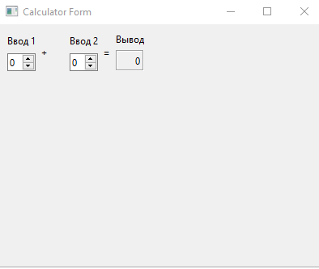

МИНИСТЕРСТВО НАУКИ  И ВЫСШЕГО ОБРАЗОВАНИЯ РОССИЙСКОЙ ФЕДЕРАЦИИ 
Федеральное государственное автономное образовательное учреждение высшего образования 
"КРЫМСКИЙ ФЕДЕРАЛЬНЫЙ УНИВЕРСИТЕТ им. В. И. ВЕРНАДСКОГО" 
ФИЗИКО-ТЕХНИЧЕСКИЙ ИНСТИТУТ 
Кафедра компьютерной инженерии и моделирования

 
<h3 align="center">Отчёт по лабораторной работе № 4  по дисциплине "Программирование"</h3>
  

студента 1 курса группы ИВТ-б-о-202(1) 
Лелеко Владислава Денисовича 
направления подготовки 09.03.01 "Информатика и вычислительная техника"

  
<table>
<tr><td>Научный руководитель  старший преподаватель кафедры  компьютерной инженерии и моделирования</td>
<td>(оценка)</td>
<td>Чабанов В.В.</td>
</tr>
</table>
  

Симферополь, 2021 

## Постановка задачи

Настроить рабочее окружение, для разработки программного обеспечния при помощи Qt и IDE Qt Creator, а также изучить базовые возможности данного фреймворка.
## Цель работы
Установить фреймворк Qt и изучить основные возможности создания и отладки программ в IDE Qt Creator.

## Выполнение работы

***Результат работы продемонстрирован ниже.***

Задание 1.

В соответсвии со следующей инструкцией установил и настроил фреймворк Qt:

1)Скачал с официального сайта и установил последнюю стабильную версию фреймворка Qt.

2)В процессе установки выбирал компоненты Qt для сборки при помощи MinGW и подходящую к этим компонентам версию MinGW.

3)Чтобы убедиться, что установка прошла успешно, запустил среду разработки Qt Creator и в разделе Примеры нашел проект Calculator Form Example.

4)Щёлкнув по проекту изучил краткую документацию по нему. Выбирал версию под Desktop, после чего нажал по кнопке Редактор.

5)На боковой панели в разделе Проекты в каталоге Формы открыл главную форму проекта и заменил текст "Input 1", "Input 2", "Output" на "Ввод 1", "Ввод 2" и "Вывод" соответственно.

6) Получил следующий результат:

  
Рис. 1. Приложение после настройки

Задание 2.

Ответы на вопросы:

1)Как изменить цветовую схему (оформление) среды?
1. Перейти к "Tools" -> "Options" -> "Environment" -> "General" вкладка,
2. Измените "Theme" на темный.

2)Как закомментировать/раскомментировать блок кода средствами Qt Creator? Имеется ввиду комбинация клавиш или пункт меню.
Закомментировать/раскомментировать секцию – ”Ctrl+/”

3)Как открыть в проводнике Windows папку с проектом средствами Qt Creator?
Используя:
QString directory = QFileDialog::getExistingDirectory(this, tr(Open Directory), , QFileDialog::ShowDirsOnly | QFileDialog::DontResolveSymlinks);

4)Какое расширение файла-проекта используется Qt Creator? 
1. “.pro” 2. “.cpp” 3. “.h” 4. “.in”

5)Как запустить код без отладки?
Запуск приложения без отладки “Ctrl + F5”

6)Как запустить код в режиме отладки?
Чтобы перейти в режим отладки в Visual Studio, необходимо нажать клавишу F5 (также вы можете выбрать пункт меню Отладка > Начать отладку или нажать кнопку Начать отладку в панели инструментов "Отладка").

7)Как установить/убрать точку останова (breakpoint)?
Выбрать строку и нажать клавишу F9, выбрать команду Отладка > Переключить точку останова или щелкнуть правой кнопкой мыши и выбрать команду Точка останова > Вставить точку останова.

Задание 3.

В 6 строке переменные равны: i= -858993460 и d= -9.2559631349317831е+61 ;
В 7 строке переменные равны: i= 5 и d= -9.2559631349317831е+61 ;
В 8 строке переменные равны: i= 5 и d= 5.0000000000000000 ;

## Вывод:
Поставленные задачи выполнены, цель работы достигнута - установлен и настроен фреймворк Qt, изучены основные возможности создания и отладки программ в IDE Qt Creator. Рабочее окружение настроено, для разработки программного обеспечения с помощью фреймворка.